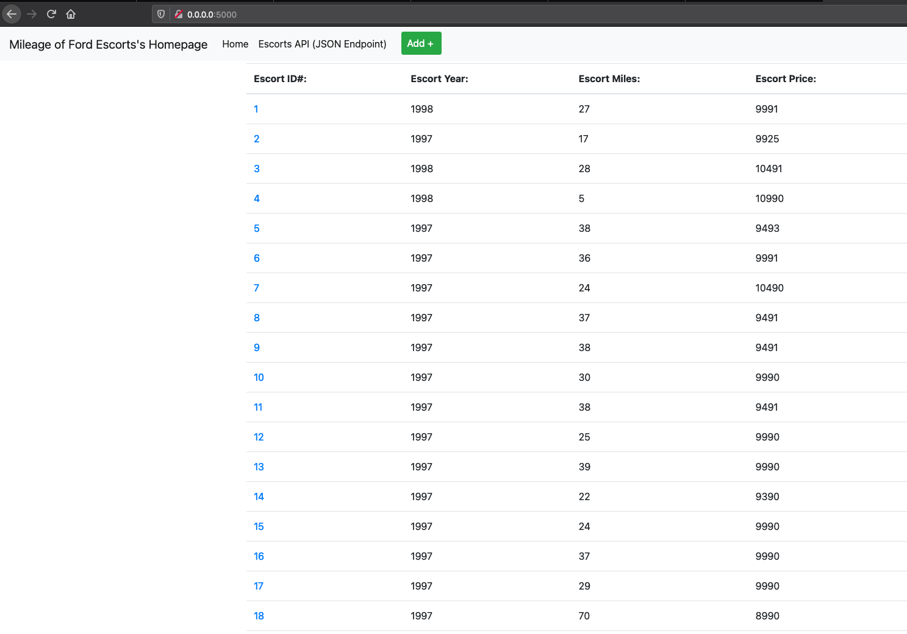

** Part Three **
Attempting to get my own version of the project/assignment
to properly function.

# Screenshot: View of Data Tables in PyCharm

# Screenshot: Browser Displaying Homepage with Data

# Screenshot: Browser Displaying a Record as a View of One Record

# Screenshot: New Record(s) Added to Homepage

# Screenshot: Browser Displaying an Updated Record Added to Homepage

# Screenshot: Deleted record(s) from homepage
